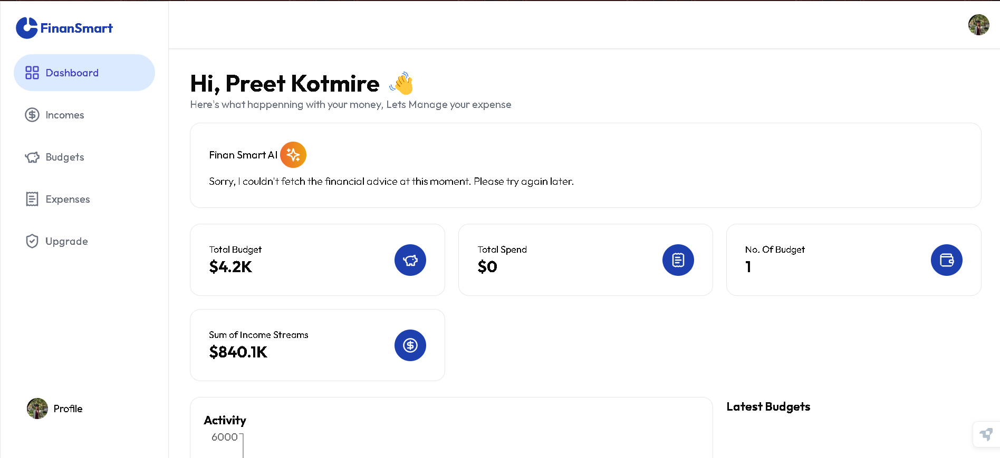

# 🚀 FinTrack - AI-Powered Personal Finance Management

<div align="center">
  
  
  [](https://nextjs.org/)
  [](https://reactjs.org/)
  [](https://www.typescriptlang.org/)
  [](https://tailwindcss.com/)
  [](https://clerk.com/)
  
  **Transform your financial life with intelligent budgeting, expense tracking, and personalized AI insights.**
</div>

---

## ✨ Features

### 🧠 **AI-Powered Insights**
- Get personalized financial advice powered by advanced AI
- Smart recommendations based on your spending patterns
- Intelligent budget optimization suggestions

### 📊 **Comprehensive Dashboard**
- Beautiful, modern interface with real-time updates
- Interactive charts and analytics
- Mobile-responsive design for on-the-go access

### 💰 **Smart Budget Management**
- Create and manage multiple budgets
- Track spending against budget limits
- Visual progress indicators and alerts

### 📈 **Expense Tracking**
- Categorize and track all your expenses
- Upload receipts and add notes
- Historical spending analysis

### 💵 **Income Management**
- Track multiple income streams
- Monitor income vs. expenses
- Financial health scoring

### 🔒 **Secure & Private**
- End-to-end encryption
- Secure authentication with Clerk
- Your data stays private and protected

---

## 🛠️ Tech Stack

| Technology | Purpose | Version |
|------------|---------|---------|
| **Next.js** | React Framework | 14.2.28 |
| **React** | Frontend Library | 18 |
| **TypeScript** | Type Safety | Latest |
| **Tailwind CSS** | Styling | 3.4.1 |
| **Framer Motion** | Animations | 11.3.2 |
| **Clerk** | Authentication | 4.30.0 |
| **Drizzle ORM** | Database ORM | 0.44.2 |
| **NeonDB** | Database | Latest |
| **OpenAI** | AI Integration | 4.52.7 |
| **Recharts** | Data Visualization | 2.12.5 |
| **Lucide React** | Icons | 0.371.0 |

---

## 🚀 Quick Start

### Prerequisites
- Node.js 18+ 
- npm or yarn
- Git

### 1. Clone the Repository
```bash
git clone https://github.com/PreetKot/FinTrack.git
cd FinTrack
```

### 2. Install Dependencies
```bash
npm install
# or
yarn install
```

### 3. Environment Setup
Create a `.env.local` file in the root directory:

```env
# Clerk Authentication
NEXT_PUBLIC_CLERK_PUBLISHABLE_KEY=your_clerk_publishable_key
CLERK_SECRET_KEY=your_clerk_secret_key

# Database
DATABASE_URL=your_neon_database_url

# OpenAI (for AI features)
OPENAI_API_KEY=your_openai_api_key
```

### 4. Database Setup
```bash
# Push database schema
npm run db:push

# (Optional) Open database studio
npm run db:studio
```

### 5. Run Development Server
```bash
npm run dev
# or
yarn dev
```

Visit [http://localhost:3000](http://localhost:3000) to see your application!

---

## 📱 Screenshots

<div align="center">
  
  <p><em>Modern, intuitive dashboard with real-time insights</em></p>
</div>

---

## 🏗️ Project Structure

```
FinTrack/
├── 📁 app/                    # Next.js App Router
│   ├── 📁 (auth)/             # Authentication pages
│   ├── 📁 (routes)/           # Protected routes
│   │   └── 📁 dashboard/      # Dashboard pages
│   └── 📁 _components/        # Shared components
├── 📁 components/             # Reusable UI components
│   └── 📁 ui/                 # shadcn/ui components
├── 📁 lib/                    # Utility libraries
├── 📁 utils/                  # Helper functions
├── 📁 drizzle/                # Database migrations
└── 📁 public/                 # Static assets
```

---

## 🎨 Design System

### Color Palette
- **Primary**: Blue gradient (`#3b82f6` to `#1d4ed8`)
- **Secondary**: Purple gradient (`#8b5cf6` to `#7c3aed`)
- **Success**: Green (`#10b981`)
- **Warning**: Yellow (`#f59e0b`)
- **Error**: Red (`#ef4444`)

### Typography
- **Font**: Outfit (Google Fonts)
- **Headings**: Bold, modern styling
- **Body**: Clean, readable text

### Components
- **Cards**: Rounded corners, subtle shadows
- **Buttons**: Gradient backgrounds, smooth transitions
- **Forms**: Clean inputs with focus states
- **Charts**: Interactive, colorful visualizations

---

## 🚀 Deployment

### Vercel (Recommended)
1. Push your code to GitHub
2. Connect your repository to Vercel
3. Add environment variables
4. Deploy!

### Manual Deployment
```bash
# Build the application
npm run build

# Start production server
npm start
```

---

## 🧪 Available Scripts

| Script | Description |
|--------|-------------|
| `npm run dev` | Start development server |
| `npm run build` | Build for production |
| `npm run start` | Start production server |
| `npm run lint` | Run ESLint |
| `npm run db:push` | Push database schema |
| `npm run db:studio` | Open Drizzle Studio |

---

## 🤝 Contributing

We love contributions! Here's how you can help:

### 1. Fork the Repository
```bash
git fork https://github.com/PreetKot/FinTrack.git
```

### 2. Create a Feature Branch
```bash
git checkout -b feature/amazing-feature
```

### 3. Make Your Changes
- Follow our coding standards
- Add tests if necessary
- Update documentation

### 4. Commit Your Changes
```bash
git commit -m "Add amazing feature"
```

### 5. Push to Branch
```bash
git push origin feature/amazing-feature
```

### 6. Open a Pull Request
- Describe your changes
- Link any related issues
- Request review

---

## 📄 License

This project is licensed under the MIT License - see the [LICENSE](LICENSE) file for details.

---

## 🎯 Roadmap

### Phase 1 ✅
- [x] User authentication
- [x] Basic budgeting
- [x] Expense tracking
- [x] AI-powered insights

### Phase 2 🚧
- [ ] Investment tracking
- [ ] Debt management
- [ ] Goal setting
- [ ] Mobile app

### Phase 3 📅
- [ ] Multi-currency support
- [ ] Bank integrations
- [ ] Advanced AI features
- [ ] Team collaboration

---

## 🐛 Bug Reports & Feature Requests

Found a bug or have a feature request? Please create an issue:

1. Go to [Issues](https://github.com/PreetKot/FinTrack/issues)
2. Click "New Issue"
3. Choose the appropriate template
4. Fill out the required information

---

## 💬 Community & Support

- **GitHub Discussions**: [Join the conversation](https://github.com/PreetKot/FinTrack/discussions)
- **Twitter**: [@FinTrackApp](https://twitter.com/FinTrackApp)
- **Email**: support@fintrack.app

---

## 📊 Stats

<div align="center">
  
</div>

---

## 🙏 Acknowledgments

- [Next.js](https://nextjs.org/) - The React framework for production
- [Tailwind CSS](https://tailwindcss.com/) - A utility-first CSS framework
- [Clerk](https://clerk.com/) - Complete user management
- [Framer Motion](https://www.framer.com/motion/) - Production-ready motion library
- [Lucide](https://lucide.dev/) - Beautiful & consistent icons
- [shadcn/ui](https://ui.shadcn.com/) - Beautifully designed components

---

<div align="center">
  <h3>⭐ Star this repository if you found it helpful!</h3>
  <p>Made with ❤️ by <a href="https://github.com/PreetKot">Preet Kotmire</a></p>
</div>